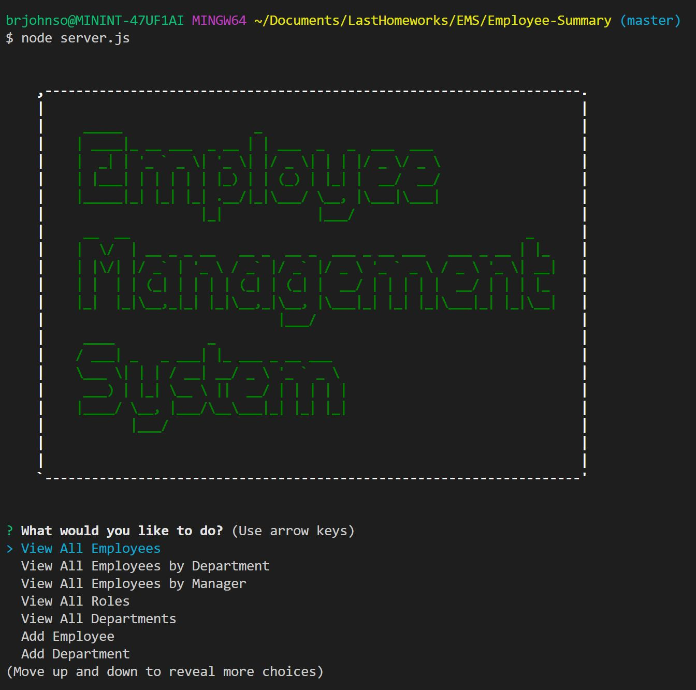

# Unit 12: Employee Management System

## Table of Contents
  - [Note Taker](#employee-management-system)
  - [Table of Contents](#table-of-contents)
  - [Description](#description)
  - [Installation](#installation)
  - [Business Context](#business-context)
  - [Demo](#demo)
  - [Contributors](#contributors)

## Description

Developers are often tasked with creating interfaces that make it easy for non-developers to view and interact with information stored in databases. Often these interfaces are known as Content Management Systems. In this homework assignment, I architected a solution for managing a company's employees using node, inquirer, and MySQL.

## Business Context

To create an application that will allow users to efficiently management their organization's employee structure.

## Tech/Modules Used :

### [MySQL](mysql.com):
* MySQL Database Service is a fully managed database service to deploy cloud-native applications using the world’s most popular open source database. It is 100% developed, managed and supported by the MySQL Team.

### [Express](https://www.npmjs.com/package/expres)
* Express is a minimal and flexible Node.js web application framework that provides a robust set of features to develop web and mobile applications. It facilitates the rapid development of Node based Web applications.

### [Inquirer](https://www.npmjs.com/package/inquirer) : 
* Inquirer.js strives to be an easily embeddable and beautiful command line interface for Node.js (and perhaps the "CLI Xanadu").

### [Javascript](https://developer.mozilla.org/en-US/docs/Web/JavaScript) : 
* JavaScript is a cross-platform, object-oriented scripting language used to make webpages interactive.
* JavaScript(JS) is a lightweight, interpreted, or just-in-time compiled programming language with first-class functions. 
* With the HTML DOM, JavaScript can access and change all the elements of an HTML document.

## Installation 
* From workstation: You must perform a "npm install" in the directory hosting the package file.
* Add both the schema.sql and seed.sql data into 'SQL WorkBench' and store it
* Run the server.js program from your command line.

# Demo
 

## Screenshot  
|

## Contributor
* Brandon Johnson
* Repository: https://github.com/sheikb08/Employee-Summary

